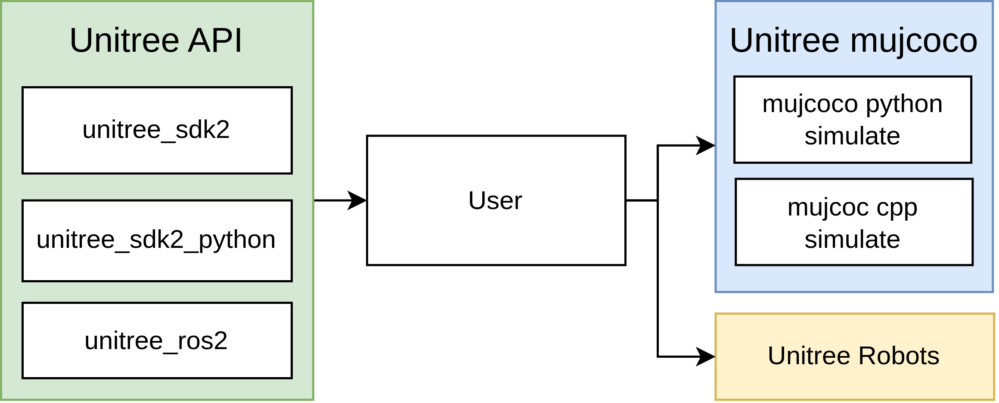
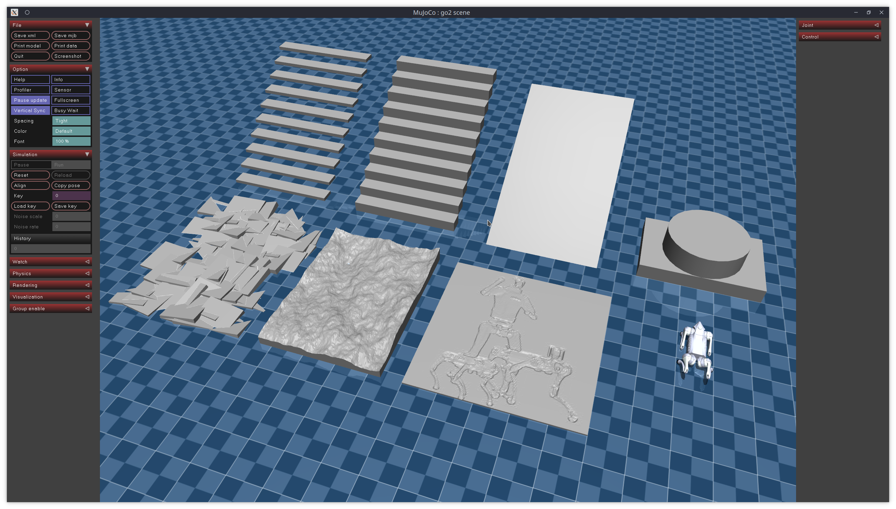

# Introduction
## Unitree mujoco
`unitree_mujoco` is a simulator developed based on `Unitree sdk2` and `mujoco`. Users can easily integrate the control programs developed with `Unitree_sdk2`, `unitree_ros2`, and `unitree_sdk2_python` into this simulator, enabling a seamless transition from simulation to physical development. The repository includes two versions of the simulator implemented in C++ and Python, with a structure as follows:


## Directory Structure
- `simulate`: Simulator implemented based on unitree_sdk2 and mujoco (C++)
- `simulate_python`: Simulator implemented based on unitree_sdk2_python and mujoco (Python)
- `unitree_robots`: MJCF description files for robots supported by unitree_sdk2
- `terrain_tool`: Tool for generating terrain in simulation scenarios
- `example`: Example programs

## Supported Unitree sdk2 Messages:
**Current version only supports low-level development, mainly used for sim to real verification of controller**
- `LowCmd`: Motor control commands
- `LowState`: Motor state information
- `SportModeState`: Robot position and velocity data

Note:
1. The numbering of the motors corresponds to the actual robot hardware. Specific details can be found in the [Unitree documentation](https://support.unitree.com/home/zh/developer).
2. In the actual robot hardware, the `SportModeState` message is not readable after the built-in motion control service is turned off. However, the simulator retains this message to allow users to utilize the position and velocity information for analyzing the developed control programs.

## Related links
- [unitree_sdk2](https://github.com/unitreerobotics/unitree_sdk2)
- [unitree_sdk2_python](https://github.com/unitreerobotics/unitree_sdk2_python)
- [unitree_ros2](https://github.com/unitreerobotics/unitree_ros2)
- [Unitree Doc](https://support.unitree.com/home/zh/developer)
- [Mujoco Doc](https://mujoco.readthedocs.io/en/stable/overview.html)

## Message (DDS idl) type description
- Unitree Go2, B2, H1, B2w, Go2w robots use unitree_go idl for low-level communication.
- Unitree G1 robot uses unitree_hg idl for low-level communication.


# Installation
## C++ Simulator (simulate)
### 1. Dependencies
#### unitree_sdk2
It is recommended to install `unitree_sdk2` in `/opt/unitree_robotics` path.
```bash
git clone https://github.com/unitreerobotics/unitree_sdk2.git
cd unitree_sdk2/
mkdir build
cd build
cmake .. -DCMAKE_INSTALL_PREFIX=/opt/unitree_robotics
sudo make install
```
For more details, see: https://github.com/unitreerobotics/unitree_sdk2
#### mujoco
Current version is tested in mujoco-3.2.7
```bash
sudo apt install libglfw3-dev libxinerama-dev libxcursor-dev libxi-dev
```
```bash
git clone https://github.com/google-deepmind/mujoco.git
mkdir build && cd build
cmake ..
make -j4
sudo make install
```
Test:
```bash
simulate
```
If the mujoco simulator pops up, the installation is successful.
#### yaml-cpp
yaml-cpp is mainly used for reading configuration files:
```bash
sudo apt install libyaml-cpp-dev
```
### 2. Compile unitree_mujoco
```bash
cd unitree_mujoco/simulate
mkdir build && cd build
cmake ..
make -j4
```
### 3. Test:
Run:
```bash
./unitree_mujoco
```
You should see the mujoco simulator with the Go2 robot loaded.
In a new terminal, run:
```bash
./test
```
The program will output the robot's pose and position information in the simulator, and each motor of the robot will continuously output 1Nm of torque.

**Note:** The testing program sends the unitree_go message. If you want to test G1 robot, you need to modify the program to use the unitree_hg message.

## Python Simulator (simulate_python)
### 1. Dependencies
#### unitree_sdk2_python
```bash
cd ~
sudo apt install python3-pip
git clone https://github.com/unitreerobotics/unitree_sdk2_python.git
cd unitree_sdk2_python
pip3 install -e .
```
If you encounter an error during installation:
```bash
Could not locate cyclonedds. Try to set CYCLONEDDS_HOME or CMAKE_PREFIX_PATH
```
Refer to: https://github.com/unitreerobotics/unitree_sdk2_python
#### mujoco-python
```bash
pip3 install mujoco
```

#### joystick
```bash
pip3 install pygame
```

### 2. Test
```bash
cd ./simulate_python
python3 ./unitree_mujoco.py
```
You should see the mujoco simulator with the Go2 robot loaded.
In a new terminal, run:
```bash
python3 ./test/test_unitree_sdk2.py
```
The program will output the robot's pose and position information in the simulator, and each motor of the robot will continuously output 1Nm of torque.

**Note:** The testing program sends the unitree_go message. If you want to test G1 robot, you need to modify the program to use the unitree_hg message.


# Usage
## 1. Simulation Configuration
### C++ Simulator
The configuration file for the C++ simulator is located at `/simulate/config.yaml`:
```yaml
# Robot name loaded by the simulator
# "go2", "b2", "b2w", "h1"
robot: "go2"
# Robot simulation scene file
# For example, for go2, it refers to the scene.xml file in the /unitree_robots/go2/ folder
robot_scene: "scene.xml"
# DDS domain id, it is recommended to distinguish from the real robot (default is 0 on the real robot)
domain_id: 1

use_joystick: 1 # Simulate Unitree WirelessController using a gamepad
joystick_type: "xbox" # support "xbox" and "switch" gamepad layout
joystick_device: "/dev/input/js0" # Device path
joystick_bits: 16 # Some game controllers may only have 8-bit accuracy

# Network interface name, for simulation, it is recommended to use the local loopback "lo"
interface: "lo"
# Whether to output robot link, joint, sensor information, 1 for output
print_scene_information: 1
# Whether to use virtual tape, 1 to enable
# Mainly used to simulate the hanging process of H1 robot initialization
enable_elastic_band: 0 # For H1
```
### Python Simulator
The configuration file for the Python simulator is located at `/simulate_python/config.py`:
```python
# Robot name loaded by the simulator
# "go2", "b2", "b2w", "h1"
ROBOT = "go2"
# Robot simulation scene file
ROBOT_SCENE = "../unitree_robots/" + ROBOT + "/scene.xml"  # Robot scene
# DDS domain id, it is recommended to distinguish from the real robot (default is 0 on the real robot)
DOMAIN_ID = 1  # Domain id
# Network interface name, for simulation, it is recommended to use the local loopback "lo"
INTERFACE = "lo"  # Interface
# Whether to output robot link, joint, sensor information, True for output
PRINT_SCENE_INFORMATION = True

USE_JOYSTICK = 1 # Simulate Unitree WirelessController using a gamepad
JOYSTICK_TYPE = "xbox" # support "xbox" and "switch" gamepad layout
JOYSTICK_DEVICE = 0 # Joystick number

# Whether to use virtual tape, 1 to enable
# Mainly used to simulate the hanging process of H1 robot initialization
ENABLE_ELASTIC_BAND = False
# Simulation time step (unit: s)
# To ensure the reliability of the simulation, it needs to be greater than the time required for viewer.sync() to render once
SIMULATE_DT = 0.003  
# Visualization interface runtime step, 0.02 corresponds to 50fps/s
VIEWER_DT = 0.02
```
### Joystick
The simulator will use an Xbox or Switch gamepad  to simulate the wireless controller of the robot. The button and joystick information of the wireless controller will be published through "rt/wireless_controller" topic. `use_joystick/USE_JOYSTICK` in `config.yaml/config.py` needs to be set to 0, when there is no gamepad. If your gamepad is not in Xbox or Switch layout, you can modify it in the source code (The button and joystick IDs can be  determined  using `jstest`):

In `simulate/src/unitree_sdk2_bridge/unitree_sdk2_bridge.cc`: 
```C++
 if (js_type == "xbox")
{
    js_id_.axis["LX"] = 0; // Left stick axis x
    js_id_.axis["LY"] = 1; // Left stick axis y
    js_id_.axis["RX"] = 3; // Right stick axis x
    js_id_.axis["RY"] = 4; // Right stick axis y
    js_id_.axis["LT"] = 2; // Left trigger
    js_id_.axis["RT"] = 5; // Right trigger
    js_id_.axis["DX"] = 6; // Directional pad x
    js_id_.axis["DY"] = 7; // Directional pad y

    js_id_.button["X"] = 2;
    js_id_.button["Y"] = 3;
    js_id_.button["B"] = 1;
    js_id_.button["A"] = 0;
    js_id_.button["LB"] = 4;
    js_id_.button["RB"] = 5;
    js_id_.button["SELECT"] = 6;
    js_id_.button["START"] = 7;
}
```

In `simulate_python/unitree_sdk2_bridge.py`: 
```python
if js_type == "xbox":
    self.axis_id = {
        "LX": 0,  # Left stick axis x
        "LY": 1,  # Left stick axis y
        "RX": 3,  # Right stick axis x
        "RY": 4,  # Right stick axis y
        "LT": 2,  # Left trigger
        "RT": 5,  # Right trigger
        "DX": 6,  # Directional pad x
        "DY": 7,  # Directional pad y
    }

    self.button_id = {
        "X": 2,
        "Y": 3,
        "B": 1,
        "A": 0,
        "LB": 4,
        "RB": 5,
        "SELECT": 6,
        "START": 7,
    }
```

### Elastic band for humanoid 
Consider humanoid robots are not suitable for starting in ground, a virtual elastic band was designed to simulate the lifting and lowering of humanoid robots. Setting ` enable_elastic_mand/ENABLE_ELSTIC_BAND=1 ` can enable the virtual elastic band. After loading the robot, press' 9 'to activate or release the strap, press' 7' to lower the robot, and press' 8 'to lift the robot.

## 2. Terrain Generation Tool
We provide a tool to parametrically create simple terrains in the mujoco simulator, including stairs, rough ground, and height maps. The program is located in the `terrain_tool` folder. For specific usage instructions, refer to the README file in the `terrain_tool` folder.


## 3. Sim to Real
The `example` folder contains simple examples of using different interfaces to make the Go2 robot stand up and then lie down. These examples demonstrate how to implement the transition from simulation to reality using interfaces provided by Unitree. Here is an explanation of each folder name:
- `cpp`: Based on C++, using `unitree_sdk2` interface
- `python`: Based on Python, using  `unitree_sdk2_python` interface
- `ros2`: Based on ROS2, using `unitree_ros2` interface

### unitree_sdk2
1. Compile
```bash
cd example/cpp
mkdir build && cd build
cmake ..
make -j4
```
2. Run:
```bash
./stand_go2 # Control the robot in the simulation (make sure the Go2 simulation scene has been loaded)
./stand_go2 enp3s0 # Control the physical robot, where enp3s0 is the name of the network card connected to the robot
```
3. Sim to Real
```cpp
if (argc < 2)
{   
    // If no network card is input, use the simulated domain id and the local network card
    ChannelFactory::Instance()->Init(1, "lo");
}
else
{   
    // Otherwise, use the specified network card
    ChannelFactory::Instance()->Init(0, argv[1]);
}
```
### unitree_sdk2_python
1. Run
```bash
python3 ./stand_go2.py # Control the robot in the simulation (make sure the Go2 simulation scene has been loaded)
python3 ./stand_go2.py enp3s0 # Control the physical robot, where enp3s0 is the name of the network card connected to the robot
```
2. Sim to Real
```python
if len(sys.argv) < 2:
    // If no network card is input, use the simulated domain id and the local network card
    ChannelFactoryInitialize(1, "lo")
else:
    // Otherwise, use the specified network card
    ChannelFactoryInitialize(0, sys.argv[1])
```
### unitree_ros2

1. Compile
First, ensure that the unitree_ros2 environment has been properly configured, see [unitree_ros2](https://github.com/unitreerobotics/unitree_ros2).

```bash
source ~/unitree_ros2/setup.sh
cd example/ros2
colcon build
```

2. Run simulation
```bash
source ~/unitree_ros2/setup_local.sh # Use the local network card
export ROS_DOMAIN_ID=1 # Modify the domain id to match the simulation
./install/stand_go2/bin/stand_go2 # Run
```

3. Run real robot
```bash
source ~/unitree_ros2/setup.sh # Use the network card connected to the robot
export ROS_DOMAIN_ID=0 # Use the default domain id
./install/stand_go2/bin/stand_go2 # Run
```